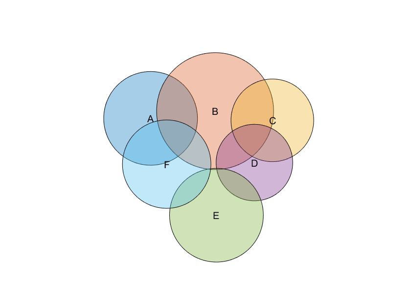

# Venn Euler Diagram

Version: 1.0

This chart creates a Venn/Euler diagram for sets which can be area-proportional.



## Syntax
* `vennEulerDiagram(setListData)` create a Venn/Euler diagram which is area-proportional. setListData must be an n x 1 cell array of vectors, where each vector corresponds to one of n sets. 
* `vennEulerDiagram(setMembershipData)` create a Venn/Euler diagram which is area-proportional. setMembershipData must be an N x n logical matrix where the (i, j)th entry is 1 if element i is contained in set j.
* `vennEulerDiagram(setListData, setLabels)` create a Venn/Euler diagram which is area-proportional and has labels as specified in setLabels, an n x 1 string vector.
* `vennEulerDiagram(setMembershipData, setLabels)` create a Venn/Euler diagram which is area-proportional and has labels as specified in setLabels, an n x 1 string vector. setMembershipData must be an N x n logical matrix where the (i, j)th entry is 1 if element i is contained in set j.
* `vennEulerDiagram()` create an empty Venn/Euler diagram.
* `vennEulerDiagram(___,Name,Value)` specifies additional options for the Venn/Euler chart using one or more name-value pair arguments. Specify the options after all other input arguments.
* `vennEulerDiagram(parent,___)` creates the Venn/Euler chart in the specified parent.
* `h = vennEulerDiagram(___)` returns the Venn/Euler chart object. Use h to modify properties of the plot after creating it.

## Name-Value Pair Arguments/Properties
* `SetListData` (n x 1 cell array) cell array containing vectors, where each vector contains the elements of a set, which can be numbers or characters. Then n is the number of sets represented in the Venn/Euler diagram.
* `SetMembershipData` (m x n numeric matrix) logical matrix of size N x n, where the (i, j)th entry is 1 if element i is contained in set j. 
* `SetLabels` (n x 1 string vector) vector containing the labels of the n sets.
* `ColorOrder` (n x 3 matrix of RGB triplets) the color order used to draw the venn/euler diagram. Has lower priority than `IntersectionColors` and `CircleFaceColors`.
* `IntersectionColors` ((2^n - 1) x 3 matrix of RGB triplets) matrix where row i contains a 1x3 RGB vector denoting the interior color of the ith disjoint intersection according to binary set indexing order. For example, with 3 sets labeled A, B, and C, `IntersectionColors` must be a 7 x 3 matrix specifying 7 RGB colors in this order: A, B, A & B, C, A & C, B & C, A & B & C. If unset, the default color order of the axes will be used. Note that if specified, `IntersectionColors` will always be used over `CircleFaceColors` (higher priority). 
* `CircleFaceColors` (n x 3 matrix of RGB triplets) matrix where row i contains a 1x3 RGB vector denoting the interior color of the circle for set i. If unset, the ColorOrder property will be used.
* `CircleEdgeColors` (n x 3 matrix of RGB triplets) matrix where row i contains a 1x3 RGB vector denoting the edge color of the circle for set i. If unset, edge colors will be black.
* `IntersectionTransparencies` (n x 1 numeric vector) vector where row i contains the transparencies (alpha) value of the disjoint intersection areas.
* `CircleFaceTransparencies` (n x 1 numeric vector) vector where row i contains the transparency (alpha) value of set i. 
* `CircleEdgeWidths` (n x 1 numeric vector) vector where row i contains the edge width of set i (i.e. the line width of the circumference of set i). 
* `ShowIntersectionCounts` (logical) whether to show the number of elements in each disjoint intersection.
* `ShowIntersectionAreas` (logical) whether to show the relative shown area of each disjoint intersection.
* `DrawProportional` (logical) whether the Venn/Euler diagram will be drawn using proportional areas for intersections using the venneuler() algorithm (Wilkinson, 2012). If false, the Venn/Euler diagram will be drawn without proportional areas for intersections (i.e. a pure Venn diagram). Since a non-proportional Venn diagram can only be drawn for up to 3 sets using circles, when DrawProportional is false, a diagram will be shown iff there are less than 3 total sets. 
* `TitleText` (n x 1 string vector) title of the chart.

## Example
Create a proportional vennEulerDiagram by giving a cell array of vectors representing sets.
```
A = [1:9];
B = [7:20];
C = [18:24];
D = [17, 18, 24:27];
E = [27:35];
F = [5:7, 16, 35:38];
setListData = {A, B, C, D, E, F};
setLabels = ['A'; 'B'; 'C'; 'D'; 'E'; 'F'];
h = vennEulerDiagram(setListData, setLabels);
```
